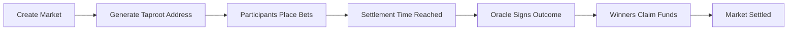

# Markstr

> **Nostr-based Bitcoin Prediction Markets using CSFS and Taproot**

Markstr is a comprehensive toolkit for creating and managing decentralized prediction markets on Bitcoin, leveraging Nostr for oracle communication and CSFS (CheckSigFromStack) for cryptographic verification.

## ✨ Features

- 🏛️ **Decentralized Markets**: Create binary prediction markets with no central authority
- ⚡ **Bitcoin Native**: Built on Bitcoin Taproot with CSFS for secure settlement
- 🔮 **Nostr Oracles**: Leverage Nostr's decentralized network for oracle communication
- 🌐 **Multi-Platform**: Rust core library, WebAssembly bindings, React webapp, and CLI
- 🔒 **Cryptographically Secure**: Oracle signatures verified via CSFS scripts
- 💰 **Proportional Payouts**: Winners receive proportional shares of the total pool

## 🚀 Quick Start

### Prerequisites

- **Rust**: Install from [rustup.rs](https://rustup.rs/)
- **Node.js**: For the webapp (v18+)
- **Git**: For cloning the repository

### Installation

```bash
# Clone the repository
git clone https://github.com/AbdelStark/markstr.git
cd markstr

# Build all components
cargo build --release

# Run the CLI
cargo run --bin markstr -- --help
```

### Create Your First Market

```bash
# Create a new prediction market
cargo run --bin markstr -- create \
  --question "Will Bitcoin reach $100k by 2024?" \
  --outcome-a "Yes" \
  --outcome-b "No" \
  --oracle "your_oracle_pubkey_hex" \
  --settlement 1735689600

# This will output a Bitcoin address where bets can be sent
```

## 📁 Project Structure

```
markstr/
├── markstr-core/          # Core Rust library
├── markstr-wasm/          # WebAssembly bindings
├── markstr-cli/           # Command-line interface
├── webapp/                # React web application
├── docs/                  # Documentation
├── examples/              # Example implementations
└── Cargo.toml             # Workspace configuration
```

## 🏗️ Architecture

### Core Components

1. **markstr-core**: Pure Rust library containing all prediction market logic
2. **markstr-wasm**: WebAssembly bindings for browser/Node.js usage
3. **markstr-cli**: Command-line interface for market creation and management
4. **webapp**: React frontend providing a complete user interface

### Market Flow



### Technical Stack

- **Bitcoin**: Taproot addresses with CSFS scripts
- **Nostr**: Decentralized oracle communication
- **Rust**: Core logic and cryptographic operations
- **WebAssembly**: Browser-compatible bindings
- **React**: Modern web interface
- **TypeScript**: Type-safe frontend development

## 🔧 Components

### Core Library (`markstr-core`)

The heart of the system, providing:

- **PredictionMarket**: Core market struct with betting and settlement logic
- **NostrClient**: Oracle communication via Nostr events
- **CSFS Verification**: Cryptographic verification of oracle signatures
- **Taproot Integration**: Bitcoin script generation and transaction handling

```rust
use markstr_core::PredictionMarket;

// Create a new market
let market = PredictionMarket::new(
    "Will it rain tomorrow?".to_string(),
    "Yes".to_string(),
    "No".to_string(),
    "oracle_pubkey_hex".to_string(),
    1735689600, // Settlement timestamp
)?;

// Get the market address for betting
let address = market.get_market_address()?;
println!("Send bets to: {}", address);
```

### WebAssembly Bindings (`markstr-wasm`)

Browser-compatible bindings for web applications:

```javascript
import init, { WasmPredictionMarket, generate_market_id } from './pkg/markstr_wasm.js';

// Initialize WASM module
await init();

// Create a market
const market = new WasmPredictionMarket(
    generate_market_id(),
    "Will Bitcoin reach $100k?",
    "Yes", "No",
    "oracle_pubkey_hex",
    1735689600, 2 // Signet network
);

// Calculate live odds
const oddsA = market.get_odds_a(100000n, 200000n); // 100k vs 200k sats
console.log(`Odds for "Yes": ${oddsA}%`);
```

### Command Line Interface (`markstr-cli`)

Full-featured CLI for power users:

```bash
# Create a market
markstr create \
  --question "Who will win the election?" \
  --outcome-a "Candidate A" \
  --outcome-b "Candidate B" \
  --oracle "abc123..." \
  --settlement 1735689600

# Generate a market ID
markstr generate-id

# Validate an address
markstr validate-address bc1q... --network 0

# Convert units
markstr convert 1.5 btc
markstr convert 150000000 sat
```

### Web Application (`webapp`)

Modern React interface with:

- **Market Creation**: Intuitive market creation flow
- **Live Betting**: Real-time odds and betting interface
- **Role Management**: Switch between Oracle, Bettor, and Viewer roles
- **Transaction History**: Complete transaction and payout tracking
- **Analytics Dashboard**: Market performance and statistics

## 🎯 Use Cases

### Financial Markets
- **Election Predictions**: Presidential, congressional, and local elections
- **Sports Betting**: Football, basketball, soccer, esports
- **Economic Indicators**: GDP growth, inflation rates, stock prices
- **Cryptocurrency**: Price predictions, adoption metrics

### Information Markets
- **Technology**: Product launches, company announcements
- **Weather**: Temperature, precipitation, natural disasters
- **Social Events**: Award shows, celebrity news, cultural events
- **Research**: Scientific discoveries, academic achievements

### Custom Applications
- **Corporate Forecasting**: Internal company predictions
- **Community Decisions**: Local governance, resource allocation
- **Academic Research**: Crowdsourced expertise aggregation
- **Risk Assessment**: Insurance, investment, project planning

## 🔒 Security Features

### Cryptographic Verification
- **CSFS Scripts**: Oracle signatures verified on-chain
- **Taproot Privacy**: Enhanced privacy through script aggregation
- **Schnorr Signatures**: Efficient signature verification
- **Hash Commitments**: Tamper-evident outcome messages

### Decentralization
- **No Central Authority**: Markets operate without intermediaries
- **Censorship Resistance**: Nostr's decentralized relay network
- **Oracle Independence**: Multiple oracle support
- **Open Source**: Full code transparency and auditability

### Economic Security
- **Proportional Payouts**: Fair distribution based on bet size
- **Fee Transparency**: Clear fee structure and deduction
- **Market Efficiency**: Real-time odds reflect true probabilities
- **Slippage Protection**: Transparent pricing mechanisms

## 📊 Examples

### Simple Weather Market

```rust
// Create a weather prediction market
let weather_market = PredictionMarket::new(
    "Will it rain in NYC tomorrow?".to_string(),
    "Yes, it will rain".to_string(),
    "No, it will not rain".to_string(),
    "weather_oracle_pubkey".to_string(),
    1735689600, // Tomorrow at noon
)?;

// Get the betting address
let address = weather_market.get_market_address()?;
println!("Weather market address: {}", address);
```

### Election Prediction Market

```bash
# Create an election market via CLI
markstr create \
  --question "Who will win the 2024 Presidential Election?" \
  --outcome-a "Democratic Candidate" \
  --outcome-b "Republican Candidate" \
  --oracle "election_oracle_pubkey_hex" \
  --settlement 1730419200  # November 1, 2024
```

### Sports Betting Market

```javascript
// Create a sports market in the webapp
const sportsMarket = new WasmPredictionMarket(
    "SPORT001",
    "Will the Lakers beat the Celtics tonight?",
    "Lakers Win",
    "Celtics Win",
    "sports_oracle_pubkey",
    Math.floor(Date.now() / 1000) + 3600, // 1 hour from now
    2 // Signet network
);

// Calculate current odds
const lakersOdds = sportsMarket.get_odds_a(75000n, 125000n); // 75k vs 125k sats
console.log(`Lakers odds: ${lakersOdds}%`);
```

## 🛠️ Development

### Building from Source

```bash
# Clone and build
git clone https://github.com/AbdelStark/markstr.git
cd markstr

# Build all Rust components
cargo build --release

# Build WebAssembly module
cd markstr-wasm
wasm-pack build --target web --out-dir pkg

# Build and run webapp
cd ../webapp
npm install
npm run dev
```

### Running Tests

```bash
# Run all tests
cargo test

# Run specific component tests
cargo test -p markstr-core
cargo test -p markstr-wasm
cargo test -p markstr-cli

# Run webapp tests
cd webapp
npm test
```

### Development Workflow

1. **Core Development**: Modify `markstr-core` for business logic changes
2. **WASM Updates**: Rebuild `markstr-wasm` when core changes
3. **CLI Updates**: Modify `markstr-cli` for command-line interface
4. **Frontend Updates**: Develop in `webapp` for user interface
5. **Testing**: Run comprehensive tests across all components
6. **Documentation**: Update README and inline documentation

## 📚 API Reference

### Core Types

```rust
// Main market struct
pub struct PredictionMarket {
    pub market_id: String,
    pub question: String,
    pub outcome_a: String,
    pub outcome_b: String,
    pub oracle_pubkey: String,
    pub settlement_timestamp: u64,
    pub network: Network,
    // ... additional fields
}

// Individual bet
pub struct Bet {
    pub payout_address: String,
    pub amount: u64,
    pub txid: String,
    pub vout: u32,
}
```

### Core Methods

```rust
impl PredictionMarket {
    // Create a new market
    pub fn new(/* ... */) -> Result<Self>;
    
    // Get the market's Bitcoin address
    pub fn get_market_address(&self) -> Result<String>;
    
    // Place a bet on an outcome
    pub fn place_bet(&mut self, /* ... */) -> Result<()>;
    
    // Settle the market with oracle signature
    pub fn settle_market(&mut self, /* ... */) -> Result<()>;
    
    // Calculate payouts
    pub fn calculate_payout(&self, /* ... */) -> u64;
    
    // Get current odds
    pub fn get_odds_a(&self) -> f64;
    pub fn get_odds_b(&self) -> f64;
}
```

### WASM API

```typescript
// TypeScript definitions for WASM bindings
export class WasmPredictionMarket {
    constructor(/* ... */);
    
    get_market_address(): string;
    get_odds_a(bets_a: bigint, bets_b: bigint): number;
    calculate_payout(bet: bigint, winning: bigint, total: bigint): bigint;
    settle_market(outcome: string): void;
    
    // Readonly properties
    readonly market_id: string;
    readonly question: string;
    readonly settled: boolean;
    // ... additional properties
}
```

## 🌐 Network Support

### Bitcoin Networks
- **Mainnet**: Production Bitcoin network
- **Testnet**: Bitcoin test network
- **Signet**: Signed test network (default for development)
- **Regtest**: Local regression testing

### Nostr Relays
- **Public Relays**: Connect to public Nostr relays
- **Private Relays**: Use custom relay infrastructure
- **Relay Discovery**: Automatic relay discovery and connection
- **Redundancy**: Multiple relay support for reliability

## 🔄 Roadmap

### Phase 1: Core Foundation ✅
- [x] Basic prediction market implementation
- [x] CSFS script generation
- [x] Taproot address creation
- [x] WebAssembly bindings
- [x] CLI interface
- [x] Web application

### Phase 2: Enhanced Features 🚧
- [ ] Multi-outcome markets (more than binary)
- [ ] Market categories and tagging
- [ ] Oracle reputation system
- [ ] Advanced analytics dashboard
- [ ] Mobile-responsive webapp
- [ ] REST API for integrations

### Phase 3: Advanced Capabilities 🔮
- [ ] Liquidity pools and market makers
- [ ] Automated market maker (AMM) integration
- [ ] Cross-chain bridge support
- [ ] Institutional trader tools
- [ ] Regulatory compliance features
- [ ] Professional oracle services

### Phase 4: Ecosystem Growth 🌱
- [ ] Third-party integrations
- [ ] Plugin architecture
- [ ] Educational resources
- [ ] Developer tools and SDKs
- [ ] Community governance
- [ ] Mainnet production deployment

## 🤝 Contributing

We welcome contributions! Please see our [Contributing Guide](CONTRIBUTING.md) for details.

### Development Setup

```bash
# Fork the repository
git clone https://github.com/YOUR_USERNAME/markstr.git
cd markstr

# Create a feature branch
git checkout -b feature/your-feature-name

# Make your changes
# ... develop ...

# Run tests
cargo test

# Submit a pull request
git push origin feature/your-feature-name
```

### Code Style

- **Rust**: Follow standard Rust conventions with `cargo fmt`
- **JavaScript**: Use Prettier for consistent formatting
- **Documentation**: Update README and inline docs for new features
- **Tests**: Add tests for new functionality

## 📄 License

This project is licensed under the MIT License - see the [LICENSE](LICENSE) file for details.

## 🙏 Acknowledgments

- **Bitcoin Core**: For the robust Bitcoin implementation
- **Nostr**: For the decentralized communication protocol
- **Rust Community**: For exceptional tooling and libraries
- **WebAssembly**: For enabling Rust in browsers
- **React**: For the modern web framework

## 📞 Support

- **Documentation**: [docs.markstr.com](https://docs.markstr.com)
- **Issues**: [GitHub Issues](https://github.com/AbdelStark/markstr/issues)
- **Discussions**: [GitHub Discussions](https://github.com/AbdelStark/markstr/discussions)
- **Email**: support@markstr.com

---

**Built with ❤️ by the Markstr team**

*Empowering decentralized prediction markets on Bitcoin*